# Fluid Reality Dashboard

The Fluid Reality Dashboard is the graphical control and configuration
application for Fluid Reality controllers. It connects over USB serial,
Bluetooth, TCP, or TLS; displays live power and current telemetry; detects and
operates actuators; guides initialization, diagnosis, and recovery; and manages
the configuration features supported by the connected controller.

The Dashboard reads the controller identity and capabilities when it connects.
Controls that the controller or connection type does not support remain
disabled, which lets the same application work with Rockford and Lansing
hardware without exposing incompatible operations.

This guide covers the complete customer workflow. Screenshots use representative
data and may differ slightly from the values reported by your hardware.

## Contents

- [Install and run](#install-and-run)
- [Connect to a controller](#connect-to-a-controller)
- [Dashboard tour](#dashboard-tour)
- [Detect and select actuators](#detect-and-select-actuators)
- [Actuator tools](#actuator-tools)
- [Board tools](#board-tools)
- [Event Log](#event-log)
- [Troubleshooting](#troubleshooting)
- [Safe shutdown](#safe-shutdown)

## Before You Begin

Place the controller and actuators on a clean, dry, non-conductive surface.
Connect the hardware as described in the appropriate kit guide:

- [Rockford Development Kit](../../docs/rockford_kit_start_here/README.md)
- [Lansing Development Kit](../../docs/lansing_kit_start_here/README.md)

The controller generates high voltage when Power is on. Keep Power off while
connecting, disconnecting, or inspecting actuators and while changing board
configuration. Wait for the displayed voltage to fall before handling the
hardware.

Serial is the only connection method available by default. Configure Bluetooth,
Wi-Fi, TCP, and TLS from the Dashboard while connected over USB serial before
using those transports.

## Install And Run

Use Python 3.10 or newer. From a cloned SDK checkout on Windows:

```powershell
cd C:\research\FluidReality\sdk
py -m venv .venv
.\.venv\Scripts\Activate.ps1
python -m pip install --upgrade pip
python -m pip install -e .
python -m pip install -r apps\fluidreality_dashboard\requirements.txt
python apps\fluidreality_dashboard\app.py
```

On macOS or Linux:

```bash
cd /path/to/sdk
python3 -m venv .venv
source .venv/bin/activate
python -m pip install --upgrade pip
python -m pip install -e .
python -m pip install -r apps/fluidreality_dashboard/requirements.txt
python apps/fluidreality_dashboard/app.py
```

The disconnected Dashboard opens with controller-dependent controls disabled.

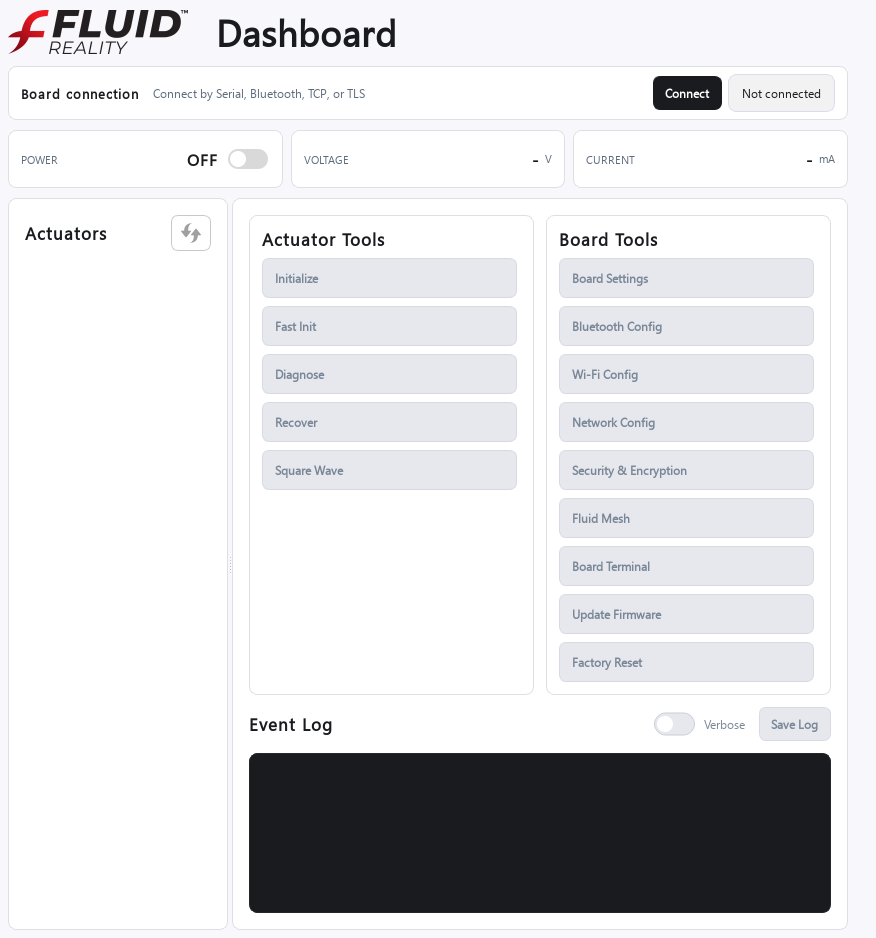

## Connect To A Controller

Select **Connect**, choose a connection type, enter its settings, and select
**OK**. After connecting, the header displays the firmware identity and active
endpoint. The Dashboard then enables the functions reported by that firmware.

### USB Serial

USB serial is the recommended first connection and the only connection enabled
by default on a new controller.

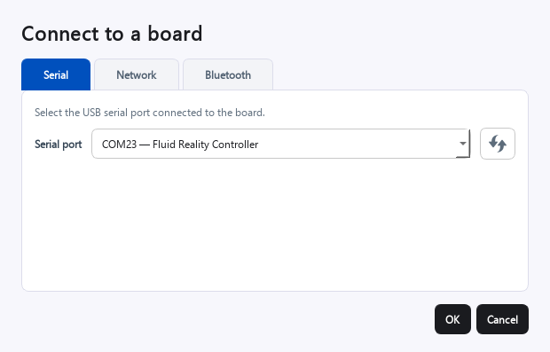

1. Connect the controller to the computer with its USB cable.
2. Select **Connect**, then select the **Serial** tab.
3. Choose the Fluid Reality controller from **Serial port**. Use the refresh
   button if the port was connected after opening the dialog.
4. Select **OK**.

The serial-port name varies by operating system. Windows commonly uses `COM23`;
Linux commonly uses `/dev/ttyACM0` or `/dev/ttyUSB0`; macOS commonly uses a
`/dev/cu.*` device.

If two ports appear, disconnect and reconnect the controller to identify the
entry that changes.

### TCP Or TLS

Use the **Network** tab after configuring Wi-Fi and Network Config over USB.
Plain TCP is suitable only on a trusted network. Enable **Encryption** to use
TLS.

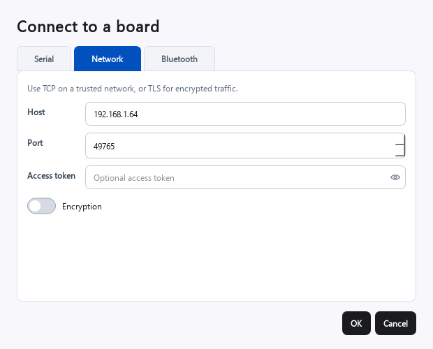

Enter:

- **Host:** the controller hostname or IPv4 address.
- **Port:** the configured TCP server port; the default is `49765`.
- **Access token:** the token configured in Security & Encryption, when access
  token authentication is enabled.
- **Encryption:** off for TCP and on for TLS.

Select **OK** to connect. If the controller address was changed, use the new
address. A timeout normally means that the address, subnet, TCP-server setting,
or computer route is incorrect. An authentication message means the controller
requires the access token.

### Bluetooth

Bluetooth must first be enabled from **Bluetooth Config** over USB serial.
Install the SDK Bluetooth dependencies before using this connection type.

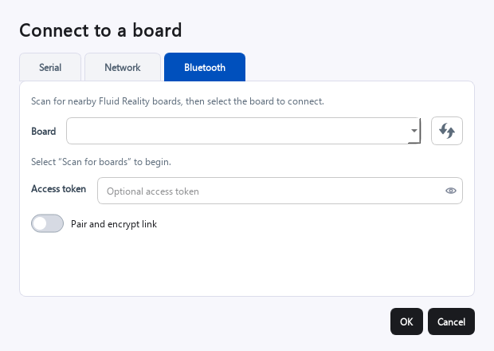

1. Select **Scan for boards**.
2. Select the controller whose advertised name begins with `FR-`.
3. Enter the access token if secure Bluetooth is enabled on the controller.
4. Enable **Pair and encrypt link** when the controller requires pairing.
5. Select **OK**.

Signal strength is shown beside discovered controllers when the operating system
provides it. If a previously paired computer can no longer connect after
security settings change, forget the pairing on both the computer and the
controller, then pair again.

## Dashboard Tour

After connection, the Dashboard presents the complete controller workflow in
one window.

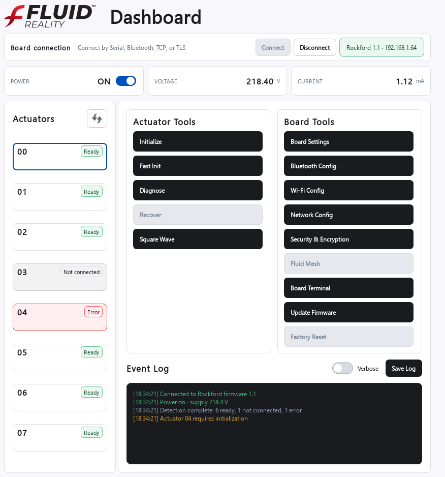

| Area | Purpose |
|---|---|
| **Board connection** | Shows the connected firmware and endpoint. **Disconnect** closes the transport without changing physical wiring. |
| **Power** | Turns the controller power supply and actuator output path on or off. |
| **Voltage** | Shows the measured controller supply voltage. |
| **Current** | Shows the measured total controller current in milliamps. |
| **Actuators** | Shows actuator number, detection state, and measured current delta. Select a card before opening an actuator tool. |
| **Redetect** | The circular-arrow button detects the visible actuator group again. |
| **Actuator Tools** | Opens Initialize, Fast Init, Diagnose, Recover, and Square Wave for the selected actuator. |
| **Board Tools** | Opens hardware and communication configuration supported by the connected firmware. |
| **Event Log** | Records connections, detection results, operations, firmware responses, and errors. |

### Power And Telemetry

Turn **Power** on only after all actuator connectors are fully seated and the
actuators are positioned safely. The Dashboard waits for the supply and output
path to become ready, then detects the visible actuator group.

On Lansing, the Power control turns on the high-voltage supply and connects it
to the actuator path. Rockford performs the corresponding operations inside its
integrated controller.

Turning Power off stops normal output and begins any required actuator discharge.
An actuator may remain in `Discharging` briefly while the controller returns its
accumulated drive balance toward neutral. Wait for discharge and the displayed
voltage to finish falling before handling hardware.

## Detect And Select Actuators

Detection must end in `Ready` before normal actuator output is allowed. Detection
runs automatically when Power becomes ready and when a different actuator group
is selected. Use the redetect button after connecting, disconnecting, or moving
an actuator.

Rockford exposes channels `0` through `7`. Its five built-in ports are channels
`0` through `4`; the optional three-actuator expansion card adds physical ports
for channels `5` through `7`. Lansing displays its channels in groups of eight.

### Actuator States

| State | Meaning and next action |
|---|---|
| `N/A` | No detection result exists in this Dashboard session. Turn Power on or run detection. |
| `Detecting` | Detection is in progress. Wait for the final result. |
| `Present` | The actuator was found and evaluation is still in progress. |
| `Ready` | Detection passed. The actuator can use the normal actuator tools. |
| `Not connected` | The controller did not measure the expected response. Confirm that the barrel connector supplies 5 V, then inspect the selected port, plug, and cable with Power off. Redetect after correcting the connection. |
| `Error` | The actuator was found, but its response is outside the normal range. Use Initialize and Diagnose; use Recover if it remains in error. |
| `Active` | The actuator is currently being driven. |
| `Discharging` | Reverse output is balancing the preceding drive. Wait for completion before starting another pulse. |
| `Fast Init` | Fast Init is actively conditioning the actuator. |

Select an actuator card to make it the target for Actuator Tools. `Not connected`
and actively detecting cards cannot be operated. Recover becomes available for
an actuator classified as `Error`.

### Recover From A Detection Problem

1. Leave normal actuator output off.
2. For `N/A` or `Present`, confirm that Power is on and run detection again.
   Review the Event Log for a communication interruption if the state does not
   advance.
3. For `Not connected`, confirm that the 5 V power supply is connected to the
   barrel input and operating. Turn Power off before reseating the keyed actuator
   connector. Inspect the cable, plug, and selected port, then turn Power on and
   redetect.
4. For `Error`, select the actuator and run **Initialize**. Run **Diagnose** to
   check the result. If diagnosis still ends in error, run **Recover**, then run
   **Diagnose** again.
5. If the actuator still does not reach `Ready`, turn Power off and compare it
   with a known-good actuator and port to isolate the actuator, cable, connector,
   or controller. Save the Event Log and process CSV before contacting Fluid
   Reality support.

## Actuator Tools

Actuator Tools operate on the selected actuator. Each process window uses the
same controls:

- **Play** starts the process.
- **Stop** ends it and restores safe output.
- **Save** exports the collected samples to CSV.
- **Close** closes the window when no process is running.

Only Stop remains active while a process is running. Starting a process again
clears the previous plot. Time plots show a rolling 30-second window. Current
plots start at `0 mA`, and the latest point is labeled on the graph.

### Initialize

Initialize conditions an actuator through a controlled bipolar sequence. It is
the normal first recovery step for an actuator that detects as `Error` or whose
diagnosis recommends initialization.

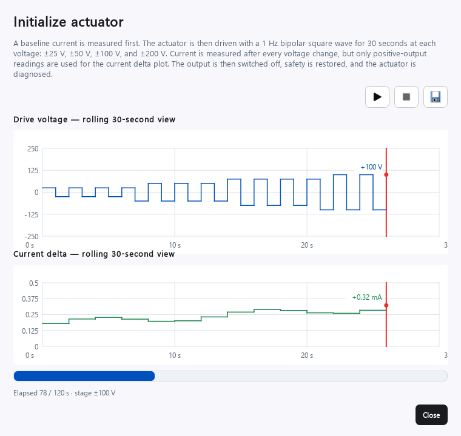

The Dashboard:

1. Measures a zero-output current baseline.
2. Alternates forward and reverse drive at 1 Hz.
3. Runs `±25 V`, `±50 V`, `±100 V`, and `±200 V` for 30 seconds per stage.
4. Measures current after each voltage change and plots the positive-output
   current delta.
5. Turns output off, restores safety, and diagnoses the actuator automatically.

The progress bar and status line show elapsed time and the active voltage stage.

### Fast Init

Fast Init targets a requested positive-output current delta in less time than the
fixed Initialize sequence. Use a target validated for the actuator.

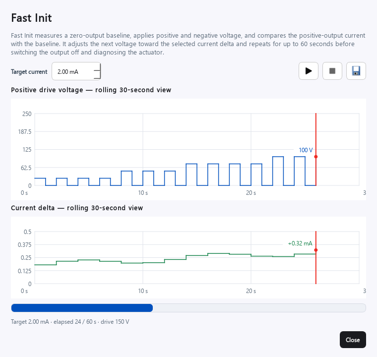

Fast Init measures a baseline, then alternates directly between positive and
reverse output. It starts at the available full voltage and adjusts the next
positive voltage by `5 V`, `10 V`, or `20 V` according to the difference from
the target. It succeeds when full voltage is reached at or below the target and
otherwise stops after 60 seconds. The target must be greater than zero and below
`3.0 mA`. Diagnosis runs after output is switched off.

### Diagnose

Diagnose measures actuator current over a voltage sweep and classifies the
complete response.

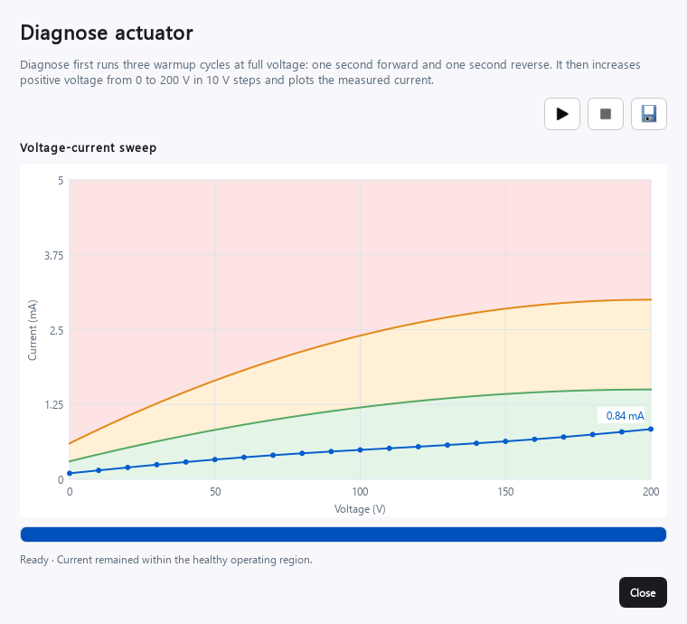

The process begins with three warmup cycles at full voltage: one second forward
and one second reverse. It then sweeps positive voltage from `0 V` to `200 V` in
`10 V` steps. The chart compares current with two reference curves:

- **Green:** healthy response.
- **Orange:** functional, but initialization is recommended.
- **Red:** response outside the acceptable range; recovery is recommended when
  the trace ends in this region.

A temporary excursion does not by itself determine the result. The Dashboard
uses the complete trace and its ending region. Save the CSV when the diagnosis
will be reviewed or shared with support.

### Recover

Recover is available for an actuator classified as `Error`. It applies a guarded
conditioning sequence and advances only after current is stable at each stage.

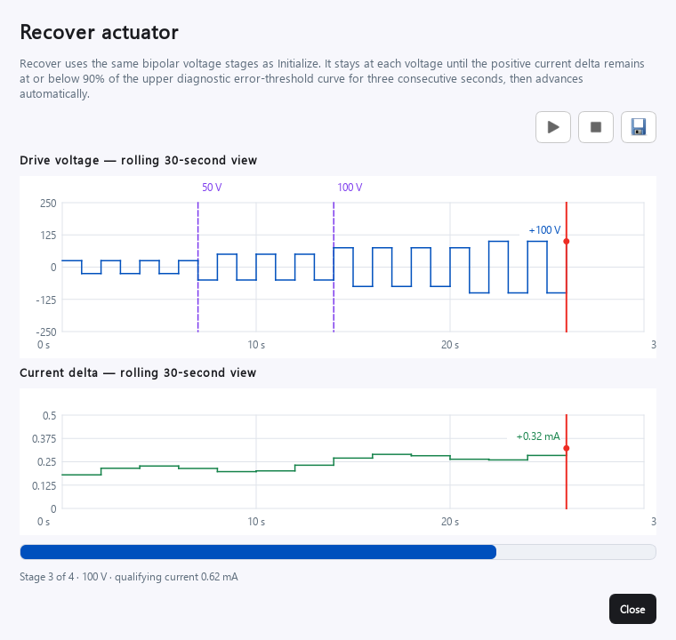

Recover uses `±25 V`, `±50 V`, `±100 V`, and `±200 V`. At each stage, the
positive-output current delta must remain at or below 90% of the diagnostic
error curve for three continuous seconds. Reverse-output current is used for
balancing but is not used to qualify the stage. Plot markers identify voltage
increases. Run Diagnose afterward to update the actuator classification.

### Square Wave

Square Wave is a continuous functional test for a `Ready` actuator.

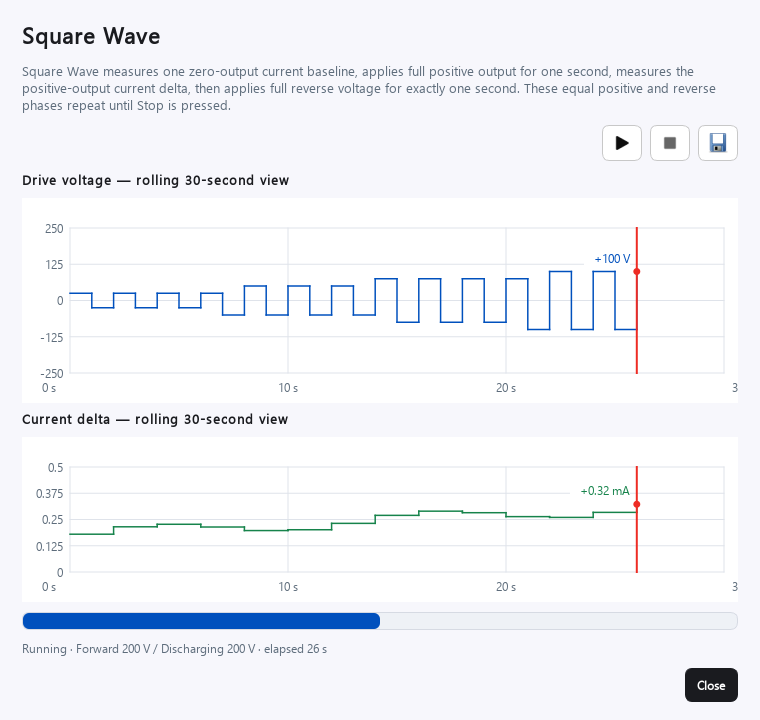

The Dashboard measures a baseline, applies full positive output for one second,
measures the positive current delta, and then applies full reverse voltage for
one second. Equal forward and reverse phases repeat until **Stop** is selected.
The plots show voltage magnitude and positive-output current delta. Always stop
the test before closing the window or disconnecting hardware.

## Board Tools

Board Tools are enabled according to firmware capabilities and connection type.
The serial view below illustrates a controller for which every implemented tool
is available. Factory Reset is USB-only; firmware update is unavailable over
Bluetooth; Fluid Mesh appears only when firmware reports support.

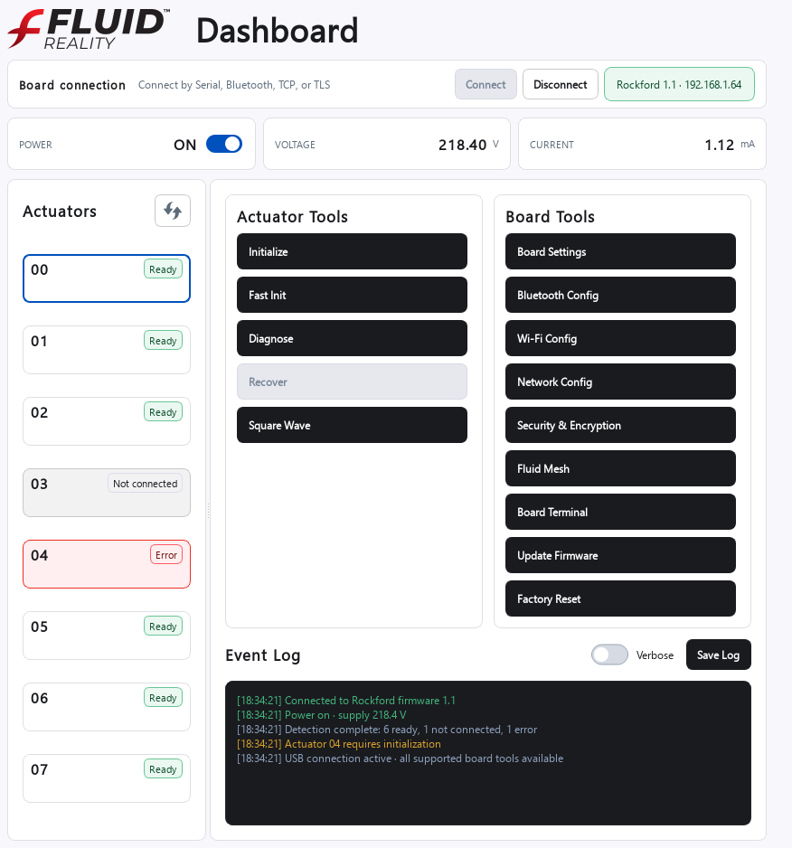

Turn Power off before changing Bluetooth, Wi-Fi, network, security, or actuator
safety settings. The Dashboard blocks changes when the hardware is not in a safe
state.

### Board Settings

Board Settings contains the actuator limits and diagnostic thresholds reported
by the connected firmware.

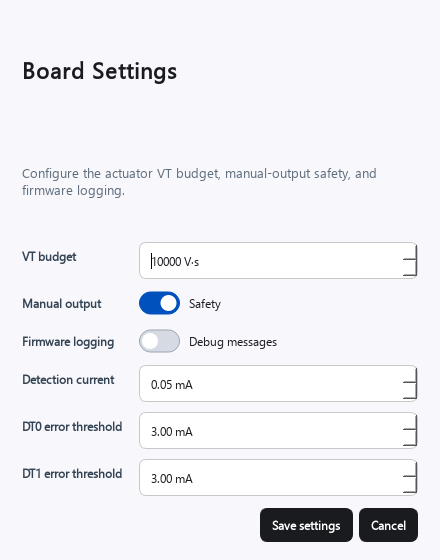

Rockford shows:

- **VT budget:** the permitted voltage-time exposure per actuator. The factory
  value is `10,000 V·s`, equivalent to `200 V` for 50 seconds.
- **Manual output / Safety:** blocks raw manual-output commands when enabled.
- **Firmware logging:** includes firmware debug messages in the Event Log.
- **Detection current:** minimum current increase used to recognize an actuator.
- **DT0 and DT1 error thresholds:** advanced detection limits.

Lansing shows maximum active and discharge time in place of the Rockford VT
budget. Change detection thresholds or safety limits only to values validated
for the connected hardware.

Changing Rockford's VT budget sets a permanent user-modified audit marker. A
factory reset restores the default value but does not erase that marker. The
Dashboard displays an additional confirmation because an incorrect value can
permanently damage actuators or controller electronics.

### Bluetooth Config

Use Bluetooth Config over USB serial before attempting a Bluetooth connection.

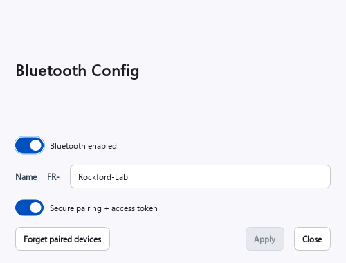

- **Bluetooth enabled** controls advertising and Bluetooth availability.
- **Name** edits the advertised-name suffix. Firmware always prepends `FR-`.
- **Secure pairing + access token** requires an encrypted paired link and the
  configured access token.
- **Forget paired devices** clears the controller's stored Bluetooth bonds.
- **Apply** saves changed settings. Restart the controller when prompted.

The name suffix accepts 1–28 letters, numbers, hyphens, or underscores. After
clearing bonds, also remove the saved pairing from the computer before pairing
again.

### Wi-Fi Config: Client Mode

Client mode connects the controller to an existing Wi-Fi network.

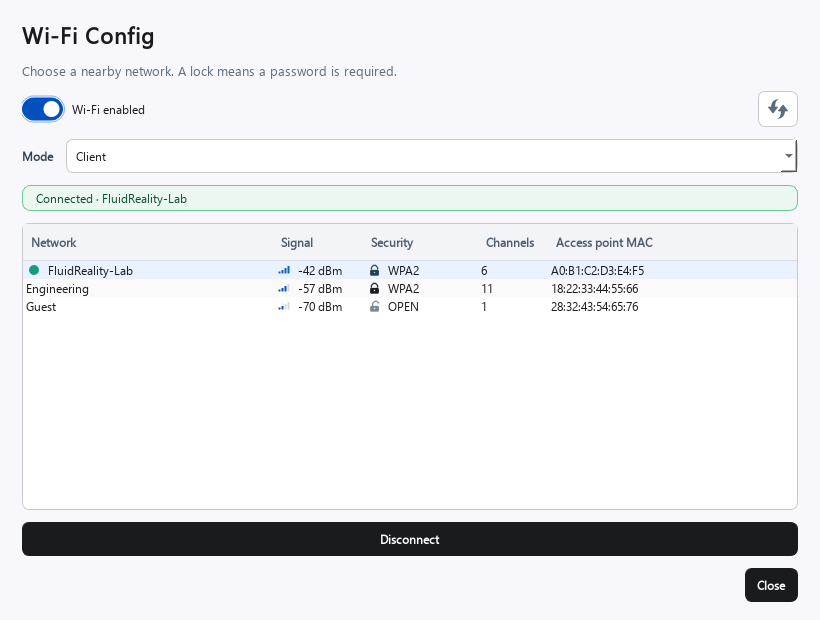

1. Turn **Wi-Fi enabled** on.
2. Select **Client** mode.
3. Refresh the network list.
4. Select a network. Signal strength, security, channels, and access-point MAC
   are shown for identification.
5. Enter the password when a lock icon indicates a secured network.
6. Select **Connect**. The status line confirms the active network.

Selecting the connected network changes the action to **Disconnect**. Networks
with the same SSID are grouped, and the strongest access point is displayed.

### Wi-Fi Config: Access Point Mode

Access Point mode creates a network hosted by the controller.

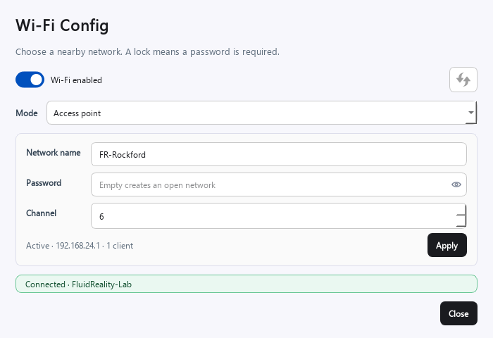

Set the network name, optional password, and channel, then select **Apply**. An
empty password creates an open network; a protected network requires a password
of 8–63 bytes. The default access-point address is `192.168.24.1`, and the
controller supplies addresses to connected clients with its DHCP server. The
status line shows the access-point state, address, and client count.

### Network Config

Network Config controls IP addressing and the controller's TCP server.

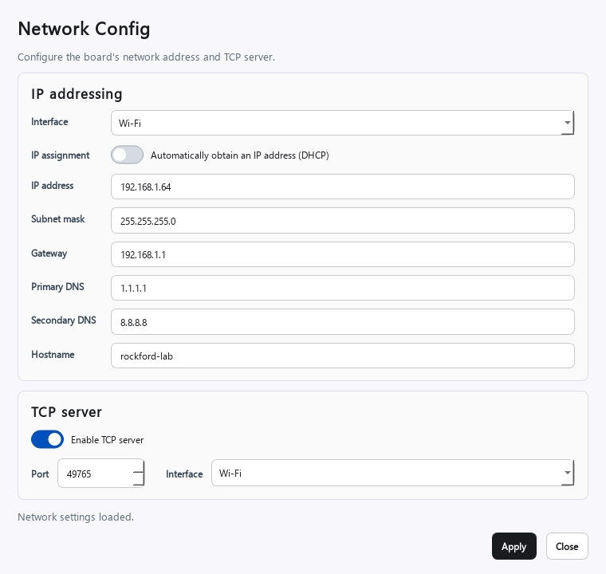

For each supported interface, configure:

- **IP assignment:** DHCP or static addressing.
- **IP address and subnet mask:** the controller address and local subnet.
- **Gateway and DNS:** required when the controller must reach other networks or
  resolve hostnames.
- **Hostname:** the controller's network name.
- **TCP server:** enables direct Dashboard and SDK connections.
- **Port:** the listening port; the default is `49765`.
- **Interface:** restricts the server to Wi-Fi, Ethernet, or any available
  interface.

Record a new static address before selecting **Apply**. A network connection may
close when its address or server settings change; reconnect to the new endpoint.
In Wi-Fi Access Point mode, the address and subnet are fixed by the access-point
configuration and gateway/DNS fields do not apply.

### Security And Encryption

Security & Encryption controls access-token authentication and TLS separately.

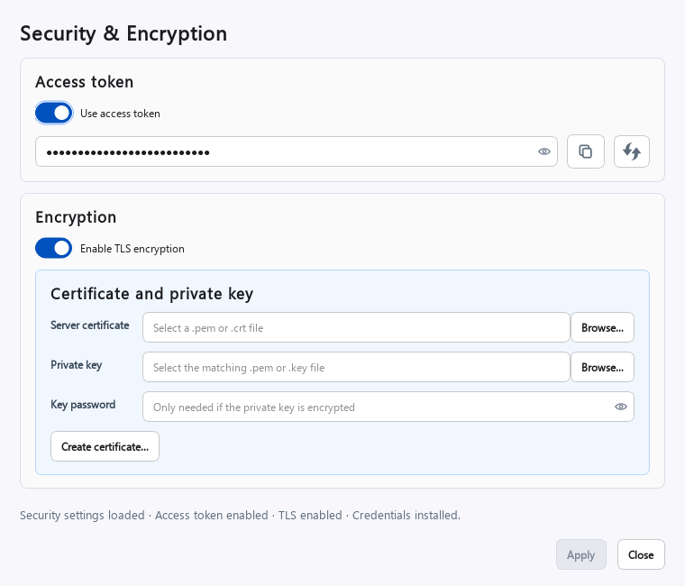

**Access token**

- Enable **Use access token** to require authentication for supported network
  and Bluetooth connections.
- Use the copy button to place the displayed token on the clipboard.
- Use the generate button to prepare a new random token, then select **Apply**.
- Store the token securely. Clients must supply the same value after the change.

**TLS encryption**

- Enable **TLS encryption** to allow encrypted network connections.
- Select the PEM-encoded server certificate and matching private key.
- Enter the private-key password only when the key is encrypted.
- Select **Apply** to install the credentials and save the TLS state.

Keep the private key private. Distribute only the server certificate to clients
that need to verify the controller.

#### Create A TLS Certificate

The Dashboard can create a self-signed server certificate and a new or existing
private key.

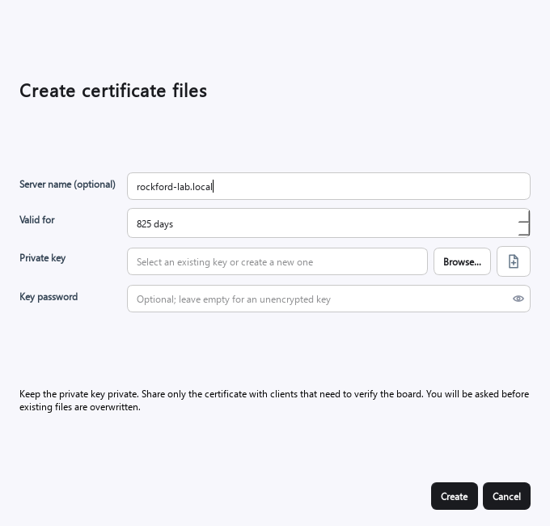

Enter the controller hostname or address as **Server name**, choose the validity
period, and select or create a private key. A key password is optional. The
Dashboard asks before overwriting existing files. After creation, the generated
certificate and key are inserted into Security & Encryption for installation.

For production networks, use certificates and retention practices appropriate
to your organization's security policy.

### Board Terminal

Board Terminal sends firmware text commands through the Dashboard's active
connection and displays raw responses.

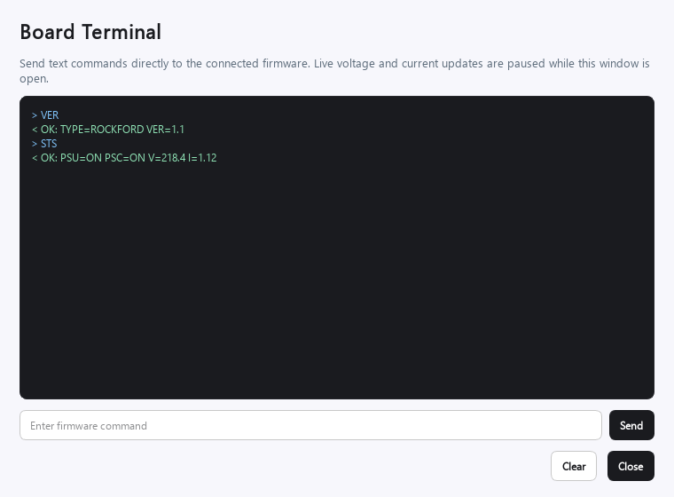

Enter one command and press Enter or select **Send**. The next command remains
disabled until the response finishes. **Clear** removes visible terminal history
without changing the controller.

Automatic status polling pauses while Board Terminal is open so background
telemetry does not mix with command responses. Polling resumes when the terminal
closes. Board Terminal is an advanced diagnostic tool; use commands documented
for the connected firmware.

### Update Firmware

Update Firmware installs a controller firmware `.bin` over USB serial, TCP, or
TLS. Bluetooth firmware updates are not supported.

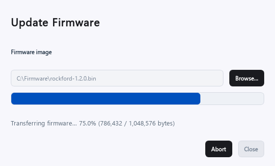

1. Select the firmware image supplied for the exact controller model.
2. Select **Update**.
3. Keep power and communication connected while the progress bar advances.
4. Wait for verification, reboot, and automatic reconnection.

The Dashboard switches outputs off before installation. **Abort** requests a
safe stop after the current transfer frame. Do not install an image intended for
a different controller.

### Factory Reset

Factory Reset is available only over USB serial and only when the firmware
reports reset support.

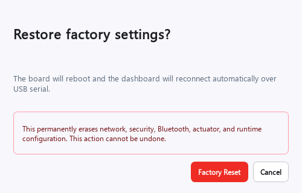

Factory Reset permanently erases saved network, security, Bluetooth, actuator,
and runtime configuration. After confirmation, the controller reboots and the
Dashboard reconnects to the same serial port. Rockford's permanent VT
user-modified audit marker is intentionally preserved.

### Fluid Mesh

Fluid Mesh is capability-dependent. The current Dashboard identifies supported
firmware but does not yet provide Fluid Mesh configuration.

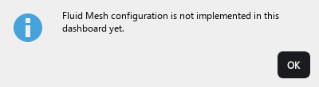

## Event Log

The Event Log records connection changes, power operations, detection results,
actuator processes, firmware responses, and failures. Messages use color to
separate successful operations, information, warnings, and errors.

- Enable **Verbose** when Fluid Reality support requests command-level details.
- Select **Save Log** to export the current session.
- Save the log before closing the Dashboard when investigating an intermittent
  connection or actuator problem.

Verbose mode can produce a large volume of low-level messages. Leave it off for
normal operation.

## Troubleshooting

| Symptom | Checks and recovery |
|---|---|
| Serial port is missing | Reconnect USB, refresh the list, try another data-capable USB cable or port, and confirm the operating-system serial driver is available. |
| Dashboard connects but voltage remains `0 V` | Confirm the 5 V power supply is connected to the barrel input and operating, then turn Power on. |
| Actuator is `Not connected` | Confirm 5 V at the barrel input. With Power off, verify the selected physical port and fully seat the keyed actuator connector. Inspect the cable, plug, and port, then redetect. |
| Actuator is `Error` | Run Initialize and Diagnose. If it remains in error, run Recover and Diagnose again. Save the process CSV and Event Log if the problem continues. |
| Actuator remains `N/A` or `Present` | Confirm Power is ready, redetect, and inspect the Event Log for an interrupted detection command or communication error. |
| TCP connection times out | Verify the controller IP address, subnet, TCP-server toggle, port, bound interface, and the computer's network route. |
| Authentication is required | Enable access-token use in the connection dialog and enter the token saved on the controller. |
| TLS connection fails verification | Confirm TLS is enabled, the installed certificate matches the controller hostname or address, and the client trusts the issuing certificate. |
| No Bluetooth controller appears | Configure Bluetooth over USB, restart the controller if requested, move within range, and scan again. Clear old bonds on both devices after security changes. |
| A configuration Apply button is disabled | Turn Power off and wait for the hardware to become safe. Some buttons also remain disabled until a value changes. |
| A Board Tool is disabled | The connected firmware may not report that capability, or the transport may not support it. Factory Reset requires USB; Update Firmware requires USB, TCP, or TLS. |
| Connection closes after a network change | Reconnect with the new address, port, authentication, and TLS settings. |
| Firmware update is interrupted | Keep the controller powered, reconnect over a supported transport, and retry with the correct firmware image. Contact Fluid Reality support if the controller no longer identifies itself. |

## Safe Shutdown

1. Stop any running Initialize, Fast Init, Diagnose, Recover, or Square Wave
   process.
2. Turn **Power** off.
3. Wait for actuator discharge to finish and for the displayed voltage to fall
   to a safe level.
4. Select **Disconnect**.
5. Disconnect physical power or actuator wiring only after the system is safe.

For Python control, connection-file examples, and the complete SDK API, return
to the [Fluid Reality SDK README](../../README.md).
