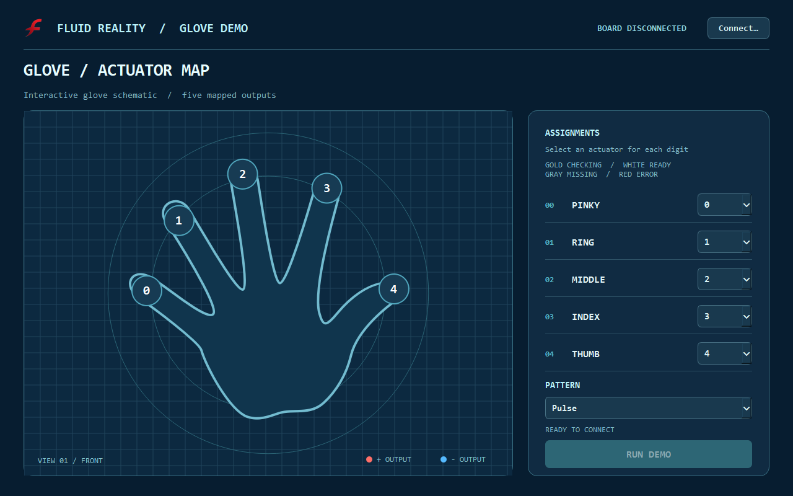

# Fluid Reality Glove Demo

A desktop demo for mapping five glove fingers to Fluid Reality actuators and
playing simple activation patterns. The Blueprint interface shows each finger's
actuator number and colors its fingertip red for positive output or blue for
negative output. Color intensity follows the output level.



The [color preview](blueprint_color_preview.png) uses simulated levels. The
[detection preview](blueprint_detection_preview.png) uses simulated detection
states. None of these previews connected to or powered a board.

## Requirements

- Python 3.10 or newer.
- A Rockford or Lansing controller connected by a USB serial port, with its
  supported power supply and actuators.
- The Python SDK and PySide6 dependencies in [requirements.txt](requirements.txt).

This demo's connection window accepts serial ports only. Network and Bluetooth
connections are not part of this app.

## Install and launch

From the SDK repository root on Windows:

```powershell
py -m pip install -e .
py -m pip install -r apps\glove_demo\requirements.txt
py apps\glove_demo\app.py
```

On macOS or Linux, use `python3` instead of `py` and forward slashes in paths.
Launching the window alone does not open a board or apply output.

## Connect and run

1. Click **Connect**, then select a detected serial port or enter one manually.
2. The app reads the firmware `VER` response to identify Lansing or Rockford.
   There is no board-type choice. An unknown identity stops the connection
   instead of guessing a profile.
3. On connection, the app checks actuator readiness once. This briefly powers
   the board for detection, then powers it off. It checks every channel on the
   identified board, so the first connection can take some time. A mapped
   finger's circle turns gold while its actuator is being checked, whitish when
   `Ready`, gray when `Not connected`, or reddish on `Error`. Detection may
   energize actuators; keep the glove clear while connecting.
4. Assign an actuator number to each finger, choose a pattern, and click
   **Run Demo**. The default mapping is pinky `0`, ring `1`, middle `2`, index
   `3`, thumb `4`. Numbers may be repeated; two fingers mapped to the same
   actuator show the same output.
5. Click **Stop Demo** to end the pattern. Mappings, pattern, and connection
   controls are locked while the demo runs. The connection remains available
   for another run after output cleanup finishes.

Patterns use only mapped actuators that are `Ready`; missing or failed channels
remain inactive. Wave patterns skip finger positions mapped to those channels.
The demo can run with fewer than five detected actuators, including repeated
finger mappings. If no mapped finger is `Ready`, **Run Demo** stays disabled.

The app uses the startup readiness result on later runs rather than repeating
actuator detection each time. If hardware changes after connecting, disconnect
and reconnect to detect it again.

## Patterns

| Pattern | Output sequence |
| --- | --- |
| Pulse | All mapped outputs ramp from `0` to `+255` over 0.5 s, hold `-255` for 0.25 s, then rest at `0` for 0.25 s. The ideal signed output-time balances each cycle. |
| Snap | All mapped outputs ramp from `+255` to `-255` over 1 s, then repeat. |
| Slow Wave | Each ready finger receives `+255` for 1 s in pinky-to-thumb order. The next finger starts after 0.75 s, overlapping the previous activation by 0.25 s. |
| Fast Wave | Each ready finger receives `+255` for 0.25 s. The next starts after 0.1875 s, overlapping the previous activation by 0.0625 s. |
| Square Wave | All mapped outputs alternate `+255` for 0.5 s and `-255` for 0.5 s. |

During a pattern, red and blue show signed activation at the fingertip; color
strength follows magnitude. When output returns to zero, the circle returns
to its detection-state color. During a wave, blue represents the expected
firmware discharge interval; the app checks the actual discharge state when
stopping. Bipolar outputs are commanded to the physical
channels sequentially, so their transitions are approximately synchronized,
not simultaneous. Serial latency can affect timing.

Wave scheduling visits each distinct ready actuator once per pass, in finger
order. Fingers sharing an actuator light together; that physical channel is
not retriggered or held on longer and must finish discharging before its next
pulse. With only one or two distinct ready actuators, firmware discharge
lockout prevents uninterrupted 25% overlap on every transition at these hold
times. Those patterns still run, but some repeat pulses are skipped rather
than overriding discharge.

## Safety and shutdown

- The app drives only mapped actuators that were `Ready` at connection time.
  It refuses to start if none are ready or if the supply voltage is zero.
- Pulse, Snap, and Square Wave use manual positive/negative output. They
  temporarily disable firmware `SAFE` and restore its previous setting on
  cleanup. The app limits accumulated signed output-time and compensates on
  stop, but this is **not** a measurement of electrode charge or a guarantee
  of safe exposure. Supervise hardware use.
- Slow Wave and Fast Wave retain firmware safety. Finger activations may overlap,
  while discharge continues in the background. The scheduler avoids polling
  the multi-line board status during the wave, then waits for all driven
  channels to finish firmware-managed discharge on stop. Firmware limits may
  shorten a requested active interval.
- Stopping, disconnecting, or closing clears output and powers the board off.
  Closing the window waits for cleanup rather than abandoning a running worker.

## Troubleshooting

- **No serial port listed:** check the cable, driver, and operating-system port
  assignment. You can type a port name manually.
- **Port busy or connection failed:** close other software using that port and
  reconnect. The app will show the board error.
- **Unsupported board firmware:** the `VER` response must identify `Lansing` or
  `Rockford`. The app will not choose one based on the port name.
- **Supply voltage is 0 V:** check the controller's external power adapter.
- **Actuator not Ready:** that channel is skipped, but other ready channels can
  still run. Inspect the glove connection, then disconnect and reconnect to
  run detection again.

## Files and tests

- [app.py](app.py): Qt window and serial-port connection dialog.
- [hand_view.py](hand_view.py): Blueprint hand rendering and fingertip colors.
- [worker.py](worker.py): firmware identification, one-time detection, pattern
  scheduling, and shutdown cleanup.
- [assets/fluid-reality-icon.png](assets/fluid-reality-icon.png): window icon,
  copied from this repository's Fluid Reality dashboard assets.

Run the hardware-free tests from the repository root:

```powershell
py -m pytest tests\test_glove_demo.py -q
```

The hand outline adapts [“Hand left.svg” by Cy21](https://commons.wikimedia.org/wiki/File:Hand_left.svg)
under [CC BY-SA 3.0](https://creativecommons.org/licenses/by-sa/3.0/). It was
mirrored, filled, recolored, and combined with fingertip markers.
