# Lansing Development Kit User Manual

Fluid Reality Lansing Dashboard

Revision: July 2, 2026

## Purpose

This manual explains how to install and operate the Fluid Reality Lansing Dashboard. It is intended for operators who need to connect to a Lansing board, enable the high-voltage power supply, verify voltage and current, detect connected actuators, initialize actuators, diagnose actuator health, recover actuators, and run controlled square-wave output.

The screenshots in this manual use representative measurements. Your port names, voltage, current, actuator health, and event-log timestamps will vary by system and board.

## Getting Started

Use Python 3.10 or newer.

Start by cloning the SDK repository and entering the dashboard application folder.

macOS or Linux:

```bash
git clone https://github.com/Fluid-Reality/sdk.git
cd sdk/apps/lansing_dashboard
python3 -m venv .venv
source .venv/bin/activate
python -m pip install --upgrade pip
python -m pip install -e ../..
python -m pip install -r requirements.txt
python app.py
```

Windows PowerShell:

```powershell
git clone https://github.com/Fluid-Reality/sdk.git
cd sdk\apps\lansing_dashboard
py -m venv .venv
.\.venv\Scripts\Activate.ps1
python -m pip install --upgrade pip
python -m pip install -e ..\..
python -m pip install -r requirements.txt
python app.py
```

The dashboard opens to the main Lansing Dashboard window. Before connection, board controls are disabled and actuator cards show `N/A` because no board state has been received.

## Dashboard Overview

The dashboard is organized into four numbered operating areas:

1. Connection: serial-port selection, port refresh, connect, disconnect, manual status refresh, and connection state.
2. Telemetry: power-supply state, output-connection state, measured voltage, measured current, and timing configuration.
3. Actuator Tools & Cards: grouped actuator cards and action tabs for initialize, diagnose, recover, and square-wave operation.
4. Event Log: timestamped connection, status, detection, diagnosis, recovery, initialization, and square-wave messages.

The top-right status pills show whether the app is idle or busy, and whether a Lansing board is connected.

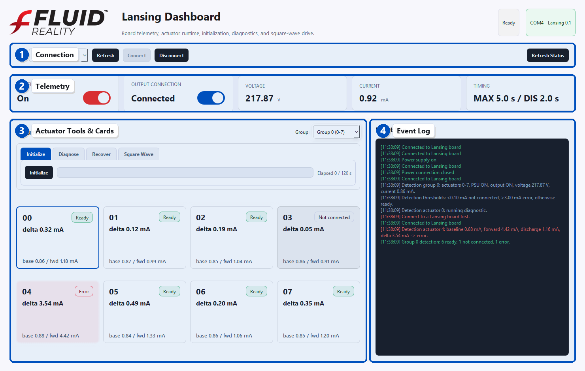

## Connect To The Board

1. Connect the Lansing board to the computer.
2. Open the dashboard.
3. Select the board serial port from the `Port` dropdown.
4. If the expected port is not visible, click `Refresh`.
5. Click `Connect`.

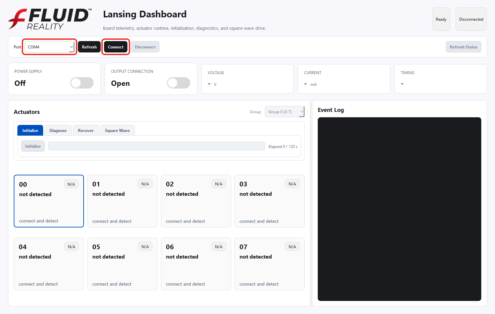

After a successful connection, the connection pill shows the selected port and board identity. The telemetry and actuator areas become available.

## Enable The Power Supply

The `Power Supply` card controls whether the high-voltage supply is enabled.

Before enabling the power supply, the connected dashboard should show the `Power Supply` card as `Off`, and the `Voltage` card should read near zero.

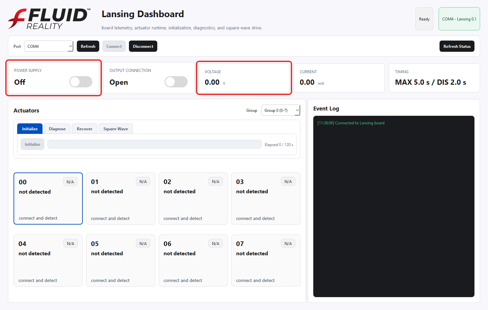

1. Confirm the board is connected.
2. Locate the `Power Supply` telemetry card.
3. Click the red toggle so the card reads `On`.
4. Watch the `Voltage` card.

When the power supply is enabled, the measured voltage should rise from near zero to the board's present supply voltage. In the example below, the dashboard shows approximately `215-220 V`.

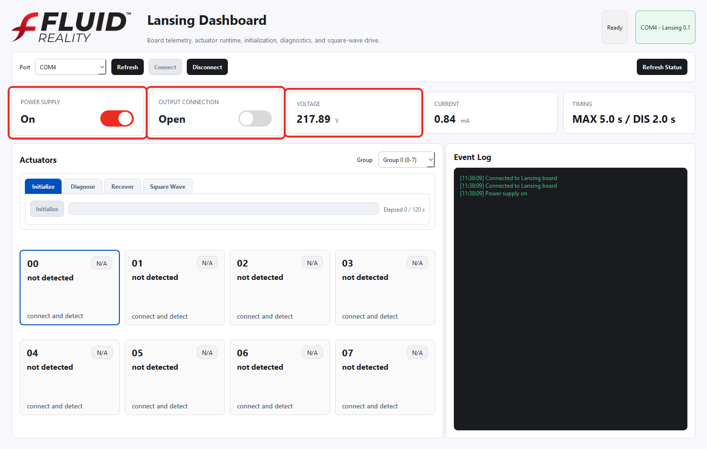

At this point the power supply is on, but the output path may still be open. The `Output Connection` card must also be enabled before actuator detection and actuator operations can run.

## Connect The Power Supply Output

The `Output Connection` card controls whether the power supply output path is connected toward the actuator side.

1. Confirm the `Power Supply` card reads `On`.
2. Locate the `Output Connection` telemetry card.
3. Click the blue toggle so the card reads `Connected`.
4. Watch the `Current` card.

The `Current` card shows the present current draw in milliamps. This is the primary place to monitor current while the board is connected, during detection, and during actuator actions.

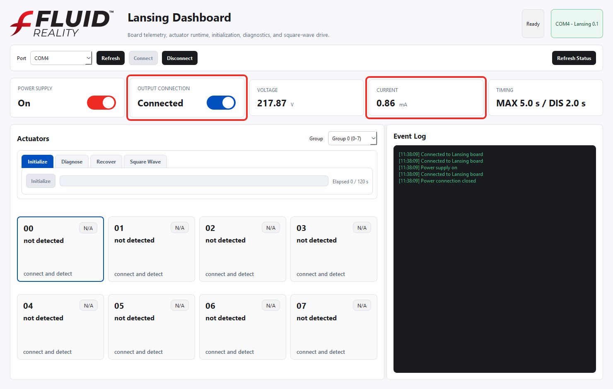

When both `Power Supply` and `Output Connection` are enabled, the dashboard automatically starts detection for the currently selected actuator group.

## Actuator Groups

The Lansing board exposes 24 actuator positions. The dashboard displays them in three groups:

| Group | Actuators |
|---|---|
| Group 0 | 0 through 7 |
| Group 1 | 8 through 15 |
| Group 2 | 16 through 23 |

Use the `Group` dropdown in the actuator panel to switch groups. Group 0 is shown by default.

In most Lansing Development Kit setups, only one actuator group is populated. That typical configuration uses Group 0, which contains actuators 0 through 7. Groups 1 and 2 are available for expanded systems that use additional actuator positions.

Clicking an actuator card selects that actuator. The action tabs apply to the selected actuator. If a card is `Not connected` or is currently `Detecting`, it cannot be selected for actuator operations.

## Actuator Status Meanings

| Status | Meaning | Available Actions |
|---|---|---|
| `N/A` | No detection result is available. This is the default state before connection and after disconnect. | None until the board is connected and detection has run. |
| `Detecting` | The dashboard is currently testing the actuator. | Wait for the result. |
| `Ready` | The actuator is connected and passed detection. | Initialize, Diagnose, Recover, Square Wave. |
| `Not connected` | Detection found no significant current change. | No actuator operations. Check cabling or actuator connection. |
| `Error` | Detection found excessive current change. | Initialize, Diagnose, and Recover are available. Square Wave is blocked. |
| `Active` | The actuator is currently being driven. | Stop or wait for the action to complete. |
| `Discharging` | The actuator is discharging after being driven. | Wait for discharge to complete before reactivation. |

Disconnecting the board resets all actuator cards to `N/A`.

## Automatic Detection

Automatic detection runs when:

- the dashboard is connected to a board,
- the power supply is `On`,
- the output connection is `Connected`, and
- a group is selected.

Detection also runs again when you select another actuator group while the board is powered and connected.

During detection, the dashboard:

1. Commands all actuators in the selected group off.
2. Runs a diagnostic on each actuator in the group.
3. Measures baseline current.
4. Drives the actuator forward and measures forward current.
5. Compares the current delta between baseline and forward.
6. Updates each actuator card immediately when that actuator's result is available.
7. Writes detailed progress to the Event Log.

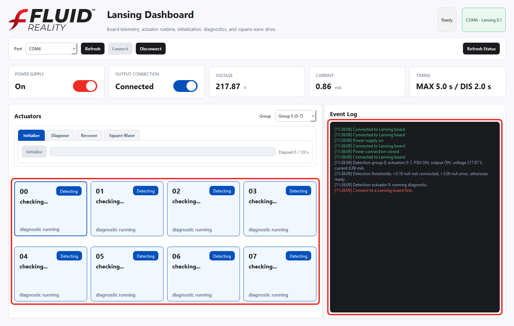

The detection thresholds are:

| Current Delta | Classification |
|---|---|
| Less than `0.10 mA` | `Not connected` |
| Greater than `3.00 mA` | `Error` |
| `0.10 mA` through `3.00 mA` | `Ready` |

An actuator classified as `Error` should be initialized before any other corrective action. The initialization process normally recovers an error-state actuator by conditioning it through staged bipolar drive and reducing the excess current drawn during diagnosis. After initialization, the dashboard runs diagnosis again so the actuator can return to `Ready` if the current delta falls back into the acceptable range.

If initialization does not reduce the current draw enough to clear the error state, the `Recover` tool can be used as a secondary corrective tool. Recovery is intended for advanced users only because it applies configurable manual drive with safety temporarily disabled during the procedure.

The Event Log records the detection group, voltage, current, thresholds, per-actuator diagnostic progress, measured baseline and forward current, and final classification.

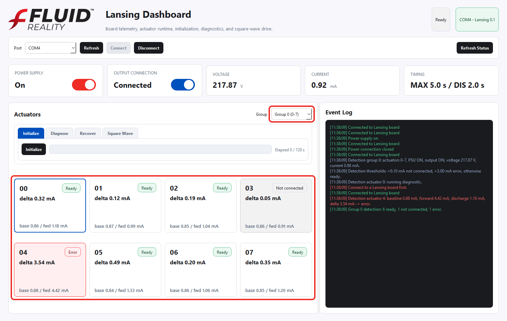

In the example, actuator 3 is `Not connected` because the current delta is below the detection threshold. Actuator 4 is `Error` because its current delta is above the error threshold. Other actuators in the group are `Ready`.

## Initialize

Use `Initialize` to condition a selected actuator through staged positive and negative drive, then diagnose it.

Initialize is the first tool tab in the dashboard and should be the first corrective action for an actuator in `Error` state. Initialize is available for both `Ready` and `Error` actuators.

The initialization sequence is:

| Stage | Target Drive | Duration |
|---|---:|---:|
| 1 | `+/-25 V` | `30 s` |
| 2 | `+/-50 V` | `30 s` |
| 3 | `+/-100 V` | `30 s` |
| 4 | `+/-200 V` | `30 s` |

Total initialization time is `120 s`.

To initialize an actuator:

1. Confirm `Power Supply` is `On`.
2. Confirm `Output Connection` is `Connected`.
3. Select a `Ready` or `Error` actuator.
4. Open the `Initialize` tab.
5. Click `Initialize`.
6. Watch the progress bar and elapsed-time label.
7. Wait for the automatic diagnosis at the end of initialization.

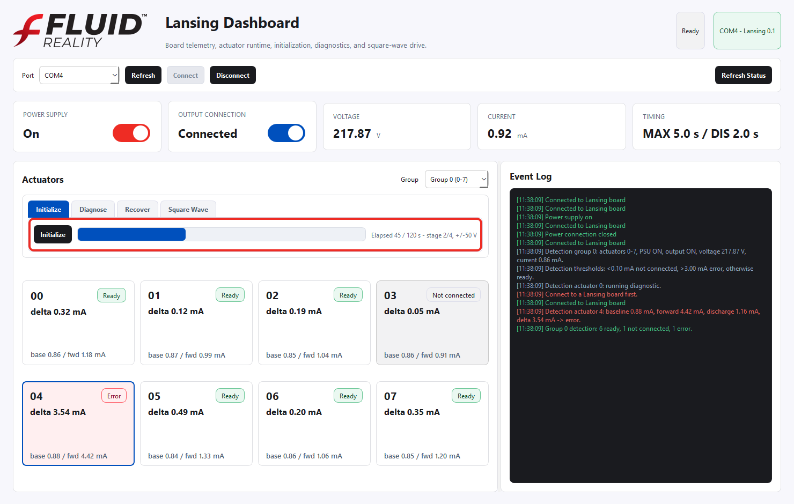

During initialization, the tab displays elapsed time, total time, the active stage, and the stage voltage. At the end of the sequence, the dashboard restores normal safety behavior and runs diagnosis automatically.

If initialization is run on an error-state actuator, use the final diagnosis result to determine whether the actuator has returned to `Ready` or still needs additional recovery or inspection.

## Diagnose

Use `Diagnose` to measure one selected actuator and display its baseline, forward, and discharge current readings.

1. Select a `Ready` or `Error` actuator card.
2. Open the `Diagnose` tab.
3. Click `Diagnose`.
4. Read the result in the tab and review the Event Log.

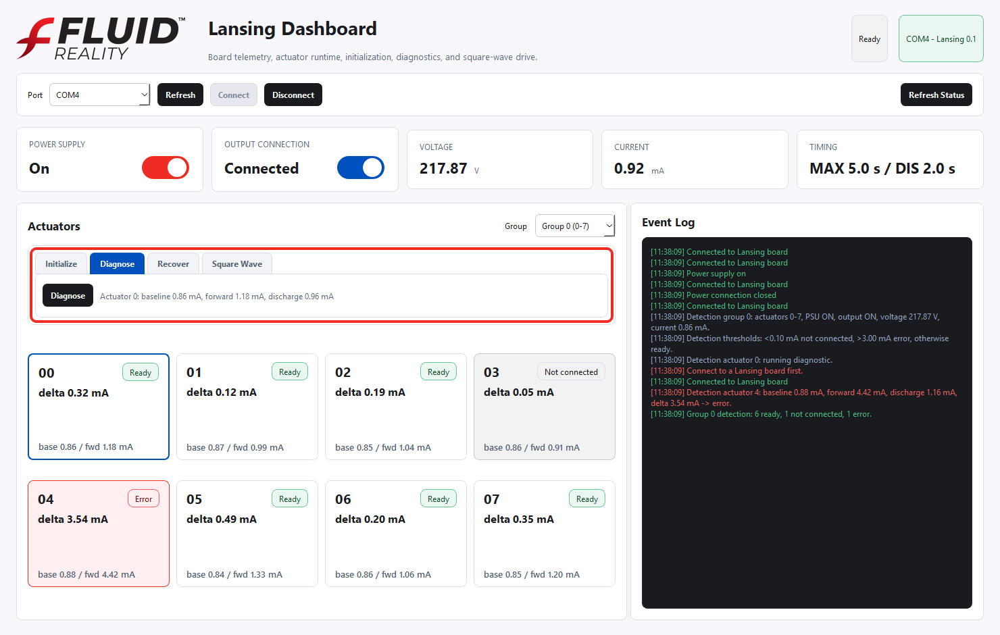

Diagnosis is also the way to reclassify an actuator after initialization or recovery. If an actuator was previously in `Error`, run `Diagnose` after the corrective action. If the measured delta returns to the acceptable range, the actuator can return to `Ready`.

## Recover

Use `Recover` when an actuator needs controlled positive and negative manual drive. Recovery is available for both `Ready` and `Error` actuators. It is not available for `Not connected` actuators.

For an actuator in `Error` state, run `Initialize` first. Use `Recover` only if initialization and the follow-up diagnosis do not return the actuator to `Ready`. Recovery is intended for advanced users only because it temporarily disables manual-output safety while the configured drive sequence is running.

Recovery parameters:

| Parameter | Default | Meaning |
|---|---:|---|
| Voltage | `50.0 V` | Target positive and negative recovery voltage. |
| Duration | `60 s` | Total recovery time. |

The dashboard scales the recovery output from the measured power-supply voltage. The measured PSU voltage is treated as raw output value `255`. For example, if the PSU reads `200 V` and recovery is set to `100 V`, the dashboard sends approximately raw value `127` in the positive direction and raw value `127` in the negative direction.

To run recovery:

1. Confirm `Power Supply` is `On`.
2. Confirm `Output Connection` is `Connected`.
3. Select a `Ready` or `Error` actuator.
4. Open the `Recover` tab.
5. Set `Voltage`.
6. Set `Duration`.
7. Click `Recover`.
8. Watch the recovery progress in the tab and Event Log.

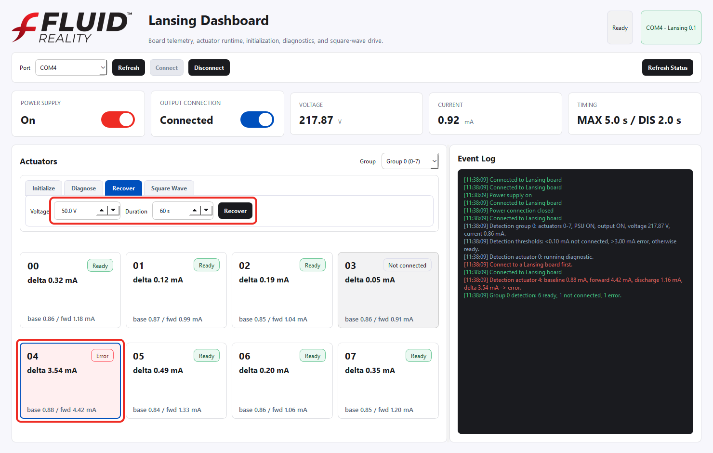

During recovery, the dashboard:

1. Measures baseline current.
2. Temporarily allows direct manual output.
3. Alternates the selected actuator between positive and negative drive.
4. Reports current and current delta every second.
5. Turns the selected actuator off at the end.
6. Restores normal safety state.
7. Shows the final current delta.

After recovery, run `Diagnose` to reclassify the actuator. If the actuator returns to the acceptable current-delta range, it can be shown as `Ready`.

## Square Wave

Use `Square Wave` to drive the selected `Ready` actuator repeatedly until stopped.

To run square wave output:

1. Confirm the actuator is `Ready`.
2. Select the actuator card.
3. Open the `Square Wave` tab.
4. Click `Start Selected`.
5. Use `Stop` to stop the square wave.
6. Use `All Off` to immediately command actuators off.

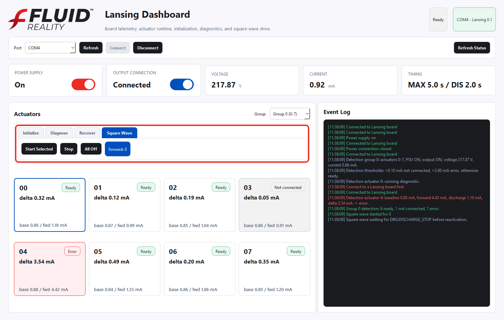

Square-wave operation applies full forward output for approximately one second, commands the actuator off, allows discharge, and waits for the board to indicate that discharge is complete before reactivating. The cycle continues until `Stop`, `All Off`, disconnect, or application close.

Square wave is disabled for actuators in `Error`, `Not connected`, `N/A`, or `Detecting` state.

## Event Log

The Event Log is the primary audit trail for board operation. It records:

- board connection and disconnection,
- power-supply changes,
- output-connection changes,
- voltage and current context during detection,
- per-actuator detection progress,
- detection thresholds and classifications,
- diagnosis results,
- recovery progress and final delta,
- initialization progress,
- square-wave start, stop, and discharge-wait messages,
- status refresh failures or command errors.

Use the Event Log whenever the dashboard state is unexpected. It usually explains whether the board is waiting for power, waiting for output connection, detecting a group, blocked by an actuator state, or waiting for discharge completion.

## Normal Operating Workflow

Use this sequence for a standard session:

1. Launch the dashboard.
2. Select the board serial port.
3. Click `Connect`.
4. Turn `Power Supply` to `On`.
5. Confirm the `Voltage` card rises to the expected supply voltage.
6. Turn `Output Connection` to `Connected`.
7. Confirm the `Current` card shows present draw in mA.
8. Wait for automatic detection to classify the selected group.
9. Select a `Ready` actuator.
10. Use the tool tabs in dashboard order as needed: `Initialize`, `Diagnose`, `Recover`, then `Square Wave`.
11. Use the Event Log to monitor command progress and measured results.
12. When finished, click `All Off` if square wave is running.
13. Set `Output Connection` to open.
14. Set `Power Supply` to off.
15. Click `Disconnect`.

## Error-State Workflow

Use this sequence when an actuator is shown as `Error`:

1. Select the error-state actuator card.
2. Review the card delta and the Event Log measurement.
3. Open the `Initialize` tab.
4. Click `Initialize`.
5. Wait for initialization to complete and review the automatic diagnosis result.
6. If the actuator returns to `Ready`, continue normal operation.
7. If the actuator remains in `Error`, open the `Recover` tab.
8. Confirm or adjust recovery `Voltage` and `Duration`.
9. Click `Recover`.
10. Watch current delta updates every second.
11. After recovery completes, run `Diagnose`.
12. If the actuator remains in `Error`, stop operation and inspect the actuator, cabling, and test setup.

`Initialize` is the first corrective action for an actuator in `Error`. Use `Recover` only if initialization and follow-up diagnosis do not return the actuator to `Ready`. `Square Wave` is not available until the actuator is classified as `Ready`.

## Shutdown

At the end of a session:

1. Stop any running square wave.
2. Click `All Off`.
3. Set `Output Connection` to open.
4. Set `Power Supply` to off.
5. Confirm the `Voltage` reading falls as expected for the system.
6. Click `Disconnect`.

After disconnect, the dashboard disables board controls and resets all actuator cards to `N/A`.

## Troubleshooting

| Symptom | Likely Cause | Action |
|---|---|---|
| Expected port is missing | Board was connected after dashboard launch or driver did not enumerate yet. | Click `Refresh`; reconnect USB if needed. |
| Controls are disabled | The dashboard is not connected. | Select a port and click `Connect`. |
| Voltage stays near zero after enabling power | Power supply did not enable or hardware is not supplying voltage. | Check board power, cabling, and the `Power Supply` toggle. |
| Output will not connect | Power supply may be off. | Turn `Power Supply` on first, then connect output. |
| Detection does not run | PSU or output connection is not ready. | Confirm both toggles are on and connected. |
| Actuator shows `Not connected` | Current delta is below `0.10 mA`. | Inspect actuator wiring and connection. |
| Actuator shows `Error` | Current delta is above `3.00 mA`. | Run `Initialize` first, then `Diagnose`; use `Recover` only if the actuator remains in error. |
| Square wave cannot start | Selected actuator is not `Ready`. | Run detection or use `Initialize`, `Diagnose`, then `Recover` as needed until the actuator is ready. |
| Operation appears paused | The board may be discharging or a long action is running. | Watch the busy pill and Event Log. |

## Safety Notes

The Lansing board can operate with high voltage. Only trained users should operate the dashboard with connected hardware.

- Verify the actuator setup before enabling the power supply.
- Do not connect the output until the test setup is ready.
- Monitor the voltage and current cards during operation.
- Use `Stop` or `All Off` if output should stop immediately.
- Disconnect output and turn off the power supply before handling hardware.
- Treat error-state actuators as requiring review before normal operation.

## Software Development

The Lansing Development Kit includes the Fluid Reality Python SDK, dashboard application, and example scripts for building custom software around Lansing hardware.

SDK repository:

- GitHub: https://github.com/Fluid-Reality/sdk
- PyPI package: `fluid-reality`
- Python import package: `fluid_reality`

Install the SDK from PyPI for application development:

```powershell
python -m pip install fluid-reality
```

Install from a local checkout when developing against the SDK source:

```powershell
git clone https://github.com/Fluid-Reality/sdk.git
cd sdk
python -m pip install -e .
```

Example scripts are provided in the repository [examples](../examples) directory:

- [01_basic_actuator_current.py](../examples/01_basic_actuator_current.py): turn on power, connect output, activate one actuator, and read current.
- [02_initialize_and_diagnose.py](../examples/02_initialize_and_diagnose.py): initialize and diagnose one actuator.
- [03_stream_sine.py](../examples/03_stream_sine.py): stream a sine wave to one actuator.
- [04_debug_logging.py](../examples/04_debug_logging.py): collect board diagnostic output through Python logging.
- [05_status_snapshot.py](../examples/05_status_snapshot.py): print a full board-state dictionary.
- [06_manual_output_bench_test.py](../examples/06_manual_output_bench_test.py): run direct bench-control output.
- [07_error_handling.py](../examples/07_error_handling.py): catch SDK exceptions and print recovery guidance.
- [08_actuator_pulse_until_key.py](../examples/08_actuator_pulse_until_key.py): repeatedly pulse an actuator until a key is pressed.

Run an example from a local checkout by passing the serial port:

```powershell
python examples\05_status_snapshot.py COM5
```

For custom applications, start with the `Lansing` wrapper from the SDK:

```python
from fluid_reality import Lansing

with Lansing("COM5") as board:
    print(board.status())
    board.power_supply(True)
    board.connect_power(True)
    print(board.voltage())
    print(board.current())
```

Developers should use the dashboard as the reference user interface for expected operator workflows, actuator health states, recovery behavior, and event-log language.
