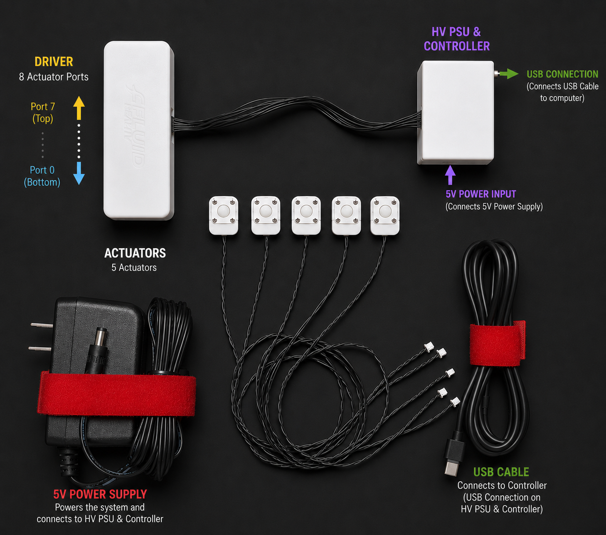
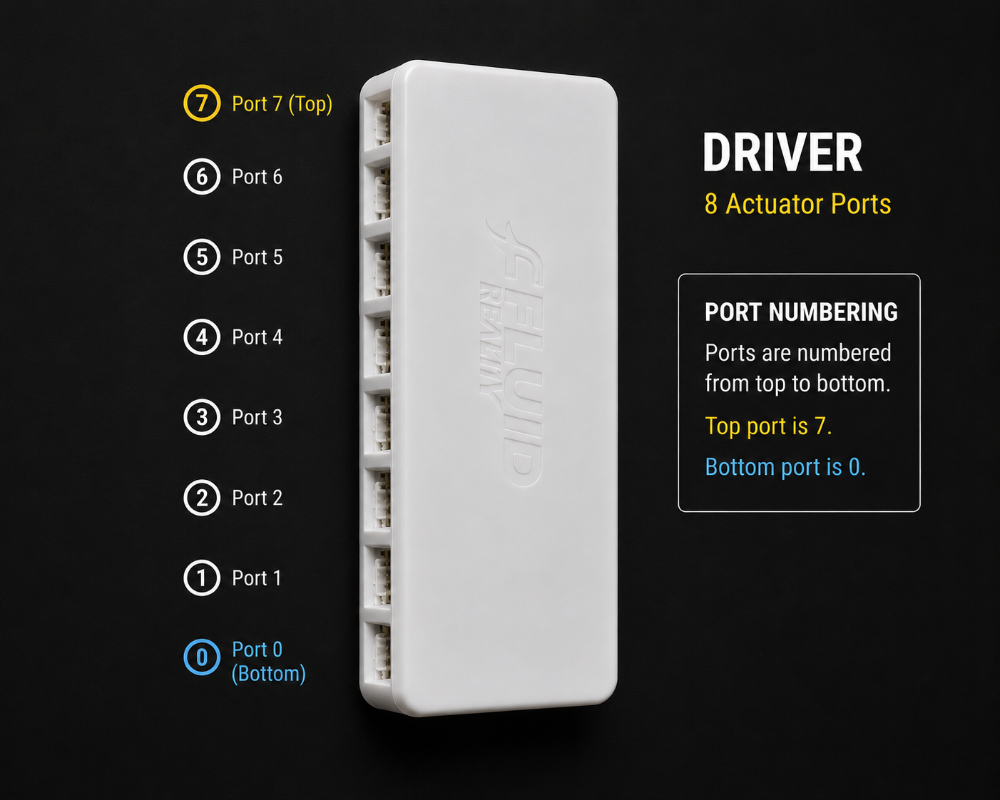

# Lansing Development Kit Start Here

This guide identifies the labeled parts in the Lansing Development Kit photo,
shows the basic assembly order, explains actuator port numbering, and points to
the software and dashboard documentation.

## Package Contents

The kit photo shows the standard Lansing Development Kit layout:

1. Driver with eight actuator ports
   The top-left white enclosure is the actuator driver. It has eight actuator
   ports for the standard kit configuration. These ports are addressed as
   actuators `0` through `7` in both the SDK and the dashboard.

2. HV PSU & controller
   The top-right white enclosure contains the high-voltage power supply and
   controller interface. The labeled `5V POWER INPUT` is where the 5 V power
   supply connects. The labeled `USB CONNECTION` is where the USB cable connects
   to the computer.

3. Actuators
   The center of the photo shows five actuator assemblies. Each actuator plugs
   into one actuator port on the driver.

4. 5 V power supply
   The bottom-left power adapter provides 5 V power to the kit.

5. USB cable
   The bottom-right USB cable connects the controller to the computer for SDK
   and dashboard communication.

## Assemble The Kit

1. Place the driver and HV PSU/controller on a clean, dry, non-conductive work
   surface.

2. Connect each actuator to an actuator port on the driver.
   Use the port numbering in the next section so the physical actuator matches
   the actuator number used in software.

3. Connect the driver cable to the HV PSU & controller if it is not already
   connected.

4. Connect the 5 V power supply to the labeled `5V POWER INPUT` on the HV PSU &
   controller.

5. Connect the USB cable to the labeled `USB CONNECTION` on the HV PSU &
   controller.

6. Connect the USB cable to the computer.

7. Leave the dashboard power supply and output connection off until the
   actuators are positioned and the operator is ready.

## Actuator Port Numbering

The driver has eight actuator ports in the standard kit configuration. The
package photo labels the numbering direction: port `0` is at the bottom of the
driver and port `7` is at the top.

The same numbering is used everywhere:

- Dashboard actuator card `0` controls physical driver port `0`.
- Dashboard actuator card `7` controls physical driver port `7`.
- SDK calls such as `board.detect(0)` and `board.set_actuator(0, 255)` control
  physical driver port `0`.

Most Lansing Development Kit configurations use one populated group with eight
actuator positions: Group 0, actuators `0` through `7`. Expanded systems can use
additional groups:

| Dashboard group | Actuator numbers |
| --- | --- |
| Group 0 | `0` through `7` |
| Group 1 | `8` through `15` |
| Group 2 | `16` through `23` |

If the hardware is physically labeled, follow the hardware labels first.

## First Software Step

For Python SDK installation, serial-port discovery, actuator state concepts,
discharge behavior, and the touch-validation example, start with the root SDK
README:

[Fluid Reality SDK README](../../README.md)

## Dashboard UI

For the graphical dashboard, setup instructions, and operator workflow, use the
dashboard README:

[Lansing Dashboard README](../../apps/lansing_dashboard/README.md)

The full dashboard operator manual is also available here:

[Lansing Development Kit Dashboard User Manual](../../apps/lansing_dashboard/docs/lansing_dashboard_manual.md)

## Basic Safety Notes

- Keep the output disconnected until actuators are positioned and ready.
- Do not handle actuator wiring while the output is connected.
- Use the dashboard or SDK detection step before driving an actuator.
- If an actuator reports `Error`, run initialization before normal use.
- Turn output off and power supply off before changing the physical setup.
