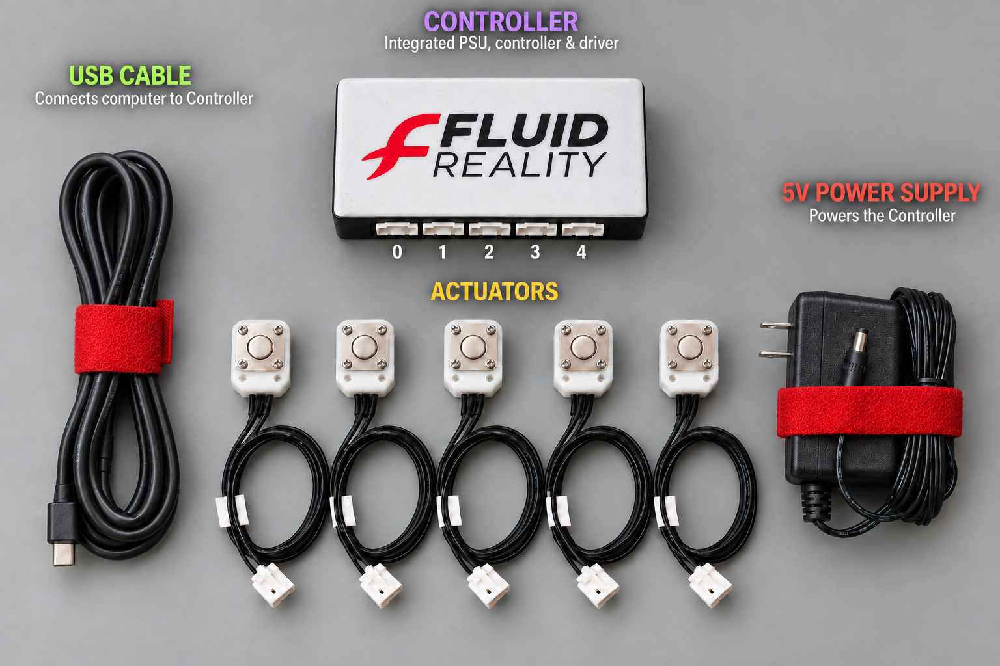
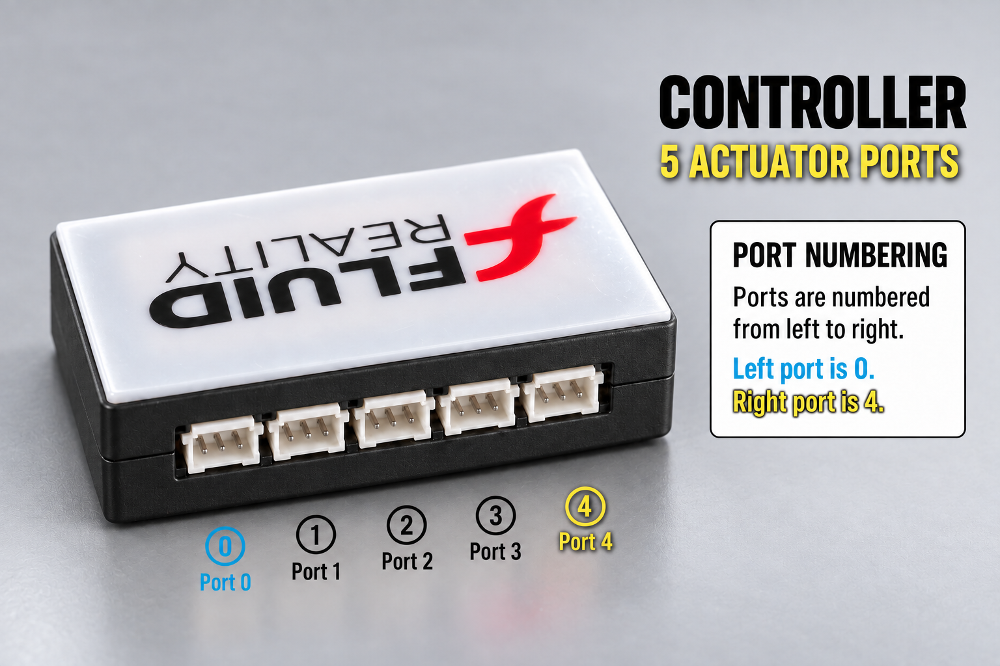
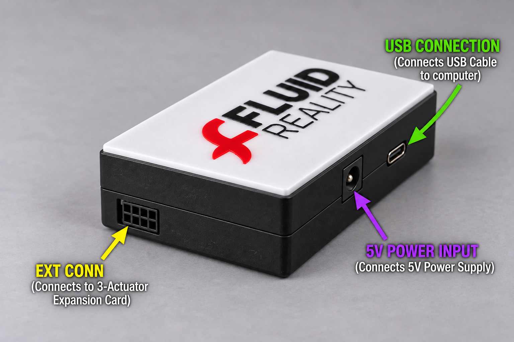

# Rockford Development Kit Start Here

This guide identifies the labeled parts in the Rockford Development Kit photo,
shows the basic assembly order, explains actuator port numbering and the optional
three-actuator expansion card, and points to the software and dashboard
documentation.



## Package Contents

The kit photo shows the standard Rockford Development Kit layout:

1. **Controller**
   The black-and-white Fluid Reality enclosure contains the high-voltage power
   supply, controller, and actuator driver electronics. Its five actuator ports
   are addressed as actuators `0` through `4` in both the SDK and dashboard.

2. **Five actuators**
   Each actuator has a square white body, metal faceplate, attached
   three-conductor cable, and keyed white connector. Each actuator plugs into
   one actuator port on the controller.

3. **5 V power supply**
   The wall adapter connects to the controller's `5V POWER INPUT` and provides
   input power for the kit.

4. **USB-C cable**
   The USB-C cable connects the controller to a computer for SDK and dashboard
   communication.

## Assemble The Kit

1. Place the controller and actuators on a clean, dry, non-conductive work
   surface.

2. With the 5 V power supply and USB-C cable disconnected, connect each actuator
   to an actuator port on the controller. Use the numbering in the next section
   so each physical actuator matches the actuator number used in software.

3. Hold the actuator plug by its plastic housing and align it with the keyed
   socket. Push the plug straight into the socket until the locking latch clicks;
   the click indicates that the connector is fully seated. To disconnect it,
   press and hold the release latch on the plug, then pull the plug straight out
   by its housing. Never pull on the wires.

4. Connect the supplied 5 V power supply to the controller's `5V POWER INPUT`,
   then connect the power supply to wall power.

5. Connect the USB-C cable to the controller's `USB CONNECTION`, then connect
   the other end to the computer.

## Actuator Port Numbering

The standard controller has five actuator ports. Viewed as shown below, the
ports are numbered from left to right: port `0` is on the left and port `4` is
on the right.



The same numbering is used everywhere:

- Dashboard actuator card `0` controls physical controller port `0`.
- Dashboard actuator card `4` controls physical controller port `4`.
- SDK calls such as `board.detect(0)` and `board.set_actuator(0, 255)` control
  physical controller port `0`.

Rockford supports eight actuator channels, numbered `0` through `7`. The five
ports built into the controller provide channels `0` through `4`.

An optional **three-actuator expansion card** adds physical ports for channels
`5`, `6`, and `7`, allowing one Rockford controller to operate as many as
eight actuators. The card connects to the controller's `EXT CONN`; actuator
plugs do not connect directly to `EXT CONN`. If the expansion card is not
installed, channels `5` through `7` remain unused.

## Controller Connections

Orient the controller as viewed from above, with actuator ports `0` through `4`
along the top edge. In this orientation:

- The **5 V power input** and **USB-C connection** are on the bottom side.
- The **extension connector** is on the lower half of the left side. It is used
  only to connect the optional three-actuator expansion card.



## First Software Step

For Python SDK installation, serial-port discovery, actuator state concepts,
discharge behavior, and the touch-validation example, start with the root SDK
README:

[Fluid Reality SDK README](../../README.md)

For initial setup, connect over USB-C. USB is also required to perform a
Rockford factory reset.

## Dashboard UI

For the graphical dashboard, setup instructions, and operator workflow, use the
dashboard README:

[Fluid Reality Dashboard README](../../apps/fluidreality_dashboard/README.md)

The full dashboard operator manual is also available here:

[Dashboard User Manual](../../apps/fluidreality_dashboard/docs/lansing_dashboard_manual.md)

The dashboard manual retains its historical Lansing filename, but the dashboard
supports both Lansing and Rockford controllers.

## Wi-Fi And Bluetooth

Complete the first setup over USB-C. Rockford can then communicate through
Bluetooth Low Energy or a configured Wi-Fi TCP/TLS connection using the same
command protocol.

For Bluetooth support in Python, install the SDK's optional Bluetooth
dependency:

```bash
python -m pip install "fluid-reality[bluetooth]"
```

For Wi-Fi credentials, IP settings, access tokens, and TLS configuration, use
the network configuration application:

[Network Configuration App](../../apps/network_config/README.md)

## Rockford Discharge Behavior

Rockford tracks a voltage-time budget for each actuator. When an actuator is
turned off, the controller applies reverse output until that actuator's
accumulated voltage-time balance returns to zero. An actuator can therefore
remain active briefly after an off command. Wait for discharge to finish before
starting another pulse or treating the actuator as idle.

The default voltage-time budget is `10,000 V·s`. Do not change it during normal
kit setup. An incorrect value can permanently damage actuators or controller
electronics.

## Basic Safety Notes

- Keep actuator output disabled until the actuators are positioned and ready.
- Do not handle actuator wiring while output is connected.
- Use the dashboard or SDK detection step before driving an actuator.
- If an actuator reports `Error`, run initialization before normal use. If it
  remains in `Error`, leave it off and check the physical connection.
- Allow Rockford's discharge phase to finish before touching or reconnecting an
  actuator.
- Disconnect wall power before changing the physical setup.
